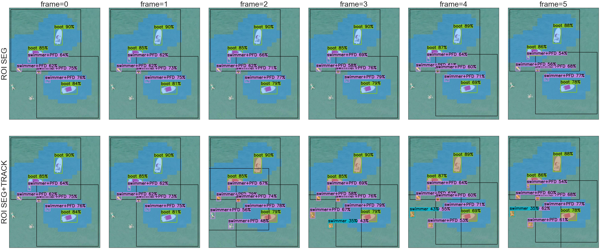

# TinyROIFusion

TinyROIFusion is a lightweight framework designed for window-based detection of tiny and multi-scale objects in high-resolution images. By leveraging object tracking-based Region of Interest (ROI) proposals, it enhances detection accuracy while maintaining computational efficiency. Detecting small and tiny objects in high-resolution images presents significant challenges due to their minimal pixel representation and the complexity of backgrounds. TinyROIFusion addresses these challenges by integrating object tracking mechanisms into segmentation-based ROI estimation. This approach generates precise ROI proposals, improving the performance of lightweight detection models.



This repository provides the implementation of the methods described in the following publication:

> Kos, A., Majek, K. and Belter, D.,
> Enhanced Lightweight Detection of Small and Tiny Objects in High-Resolution Images Using Object Tracking-Based Region of Interest Proposal.
> Available at SSRN 4951026.


# Installation
We provide a Docker environment that manages all dependencies, downloads pretrained models, and sets up datasets automatically.
```console
git clone https://github.com/deepdrivepl/TinyROIFusion.git && cd TinyROIFusion
./build_and_run.sh
```


# Inference

To run inference on the SeaDronesSee and DroneCrowd datasets, execute `./exps.sh`. This script runs the inference process and saves predictions in COCO format in the `results/SeaDronesSee` and `results/DroneCrowd` directories. It also generates visualizations of ROIs, detection windows, and detected objects.

## SeaDronesSee
```console
python inference_sequence.py --out_dir results/SeaDronesSee \
--ds SeaDronesSee --split val \
--mode 'roi_track' \
--merge  \
--obs_iou_th 0.1 \
--debug --vis_conf_th 0.1 --show_label
```

## DroneCrowd
```console
python inference_sequence.py --out_dir results/DroneCrowd \
--ds DroneCrowd --flist data/DroneCrowd/test_minus_val.txt --name test_minus_val \
--mode 'roi_track' \
--merge \
--obs_iou_th 0.7 --second_nms \
--debug --vis_conf_th 0.1
```

# Acknowledgements

This project builds upon existing research in object detection, tracking, and region proposal methods.
- [SeaDronesSee](https://seadronessee.cs.uni-tuebingen.de/)
- [DroneCrowd](https://github.com/VisDrone/DroneCrowd)
- [UNet](https://arxiv.org/abs/1505.04597)
- [SORT](https://arxiv.org/abs/1602.00763)
- [YOLOv7](https://arxiv.org/abs/2207.02696)
